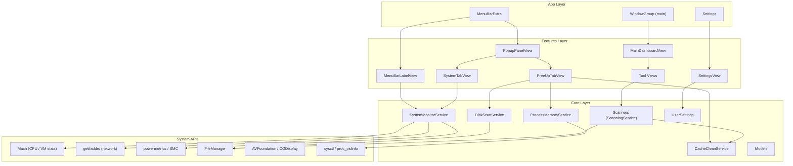
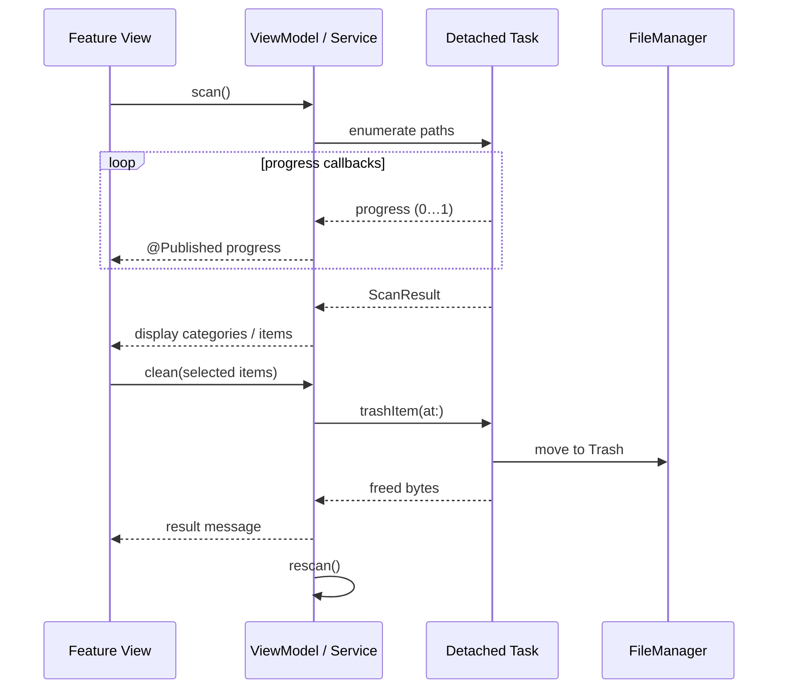

# Airy Architecture

High-level design reference for the Airy macOS app (bundle ID `com.junhey.Airy`).

## Layer Diagram



## Scene Structure

`AiryApp` defines three SwiftUI scenes:

| Scene | ID / Style | Content |
|-------|------------|---------|
| `MenuBarExtra` | `.window` style | `PopupPanelView` + `MenuBarLabelView` label |
| `WindowGroup` | `"main"` | `MainDashboardView` (800×520 default) |
| `Settings` | — | `SettingsView` |

`SystemMonitorService` is created at app launch and injected into the menu bar scene via `@EnvironmentObject`.

## Module Map

```text
LemonCleaner/
├── AiryApp.swift
├── Features/
│   ├── MenuBar/          MenuBarLabelView
│   ├── PopupPanel/       PopupPanelView, FreeUpTabView, SystemTabView, …
│   ├── MainWindow/       MainDashboardView, tool-specific views
│   └── Settings/         SettingsView
├── Core/
│   ├── Services/
│   │   ├── SystemMonitorService.swift   # CPU, mem, disk, net, temp
│   │   ├── DiskScanService.swift        # Popup quick-clean scan
│   │   ├── ProcessMemoryService.swift   # Top apps + memory release
│   │   ├── ToolServices.swift           # LargeFile, Duplicate, Privacy, DiskAnalyzer scanners
│   │   ├── PrivacyMonitorService.swift  # TCC status helpers
│   │   └── SMCReader.swift              # CPU temperature via powermetrics
│   ├── Models/           ScanResult, SystemMetrics, ProcessInfo, PrivacyStatus
│   ├── Settings/         UserSettings (threshold, scanFullDisk, privacy toggles)
│   └── Utilities/        ByteFormatter
└── UI/Components/        AppTheme, FooterBar, ProgressOverlay, …
```

## Service Responsibilities

### SystemMonitorService

- Publishes `SystemMetrics` every second via `Timer.publish`.
- Delegates to small reader enums: `CPUStatsReader`, `MemoryStatsReader`, `DiskStatsReader`, `NetworkStatsReader`, `SMCReader`.
- Started when the popup appears; drives both the menu bar label and System tab.

### DiskScanService (popup)

- Scans fixed targets: `~/Library/Caches`, `~/Library/Logs`, `~/.Trash`, crash reports, temp.
- Runs on a detached utility task; reports progress back to `@MainActor`.
- Results feed the FreeUp **Clean** action.

### ProcessMemoryService

- Reads process list via `sysctl(KERN_PROC_ALL)` and `proc_pidinfo`.
- Aggregates RSS by bundle ID; shows top 6 in the popup.
- **Release** runs `/usr/sbin/purge` when available, else `malloc_zone_pressure_relief`.

### Scanners (`ScanningService` protocol)

Defined in `Core/Models/ScanResult.swift`:

```swift
protocol ScanningService {
    func scan(progress: @escaping (Double) -> Void) async throws -> ScanResult
    func clean(items: [ScanItem]) async throws -> Int64
}
```

Implementations in `ToolServices.swift`:

| Scanner | Scan strategy | Clean |
|---------|---------------|-------|
| `LargeFileScanner` | Enumerate files ≥ threshold MB | `CacheCleanService` |
| `DuplicateFileScanner` | Group by size, SHA-256 hash | `CacheCleanService` |
| `PrivacyCleanService` | Browser cache directories | `CacheCleanService` |
| `DiskAnalyzerService` | Top-level directory sizes (analyze only) | — |

`ToolScanViewModel` in the main window orchestrates scan → select → clean for any `ScanningService`.

## Data Flow: Scan & Clean



### Popup path

`PopupPanelViewModel` owns `DiskScanService` and `CacheCleanService`. On appear it starts `SystemMonitorService`, runs `diskScan.scan()`, and refreshes process memory. Clean confirms via dialog, then trashes all scan items.

### Main window path

Each tool view wraps `ToolScanViewModel` with a specific scanner. User toggles items in `ScanResultListView`; clean calls `scanner.clean(items:)` which delegates deletion to `CacheCleanService`.

## Concurrency Model

- UI and `@Published` state live on `@MainActor`.
- File enumeration and hashing run in `Task.detached(priority: .utility)`.
- Progress callbacks hop back to main actor via `Task { @MainActor in … }`.

## External Dependencies

No third-party packages. Uses Apple frameworks only: SwiftUI, AppKit, Foundation, CryptoKit, ImageIO, AVFoundation, Darwin.
